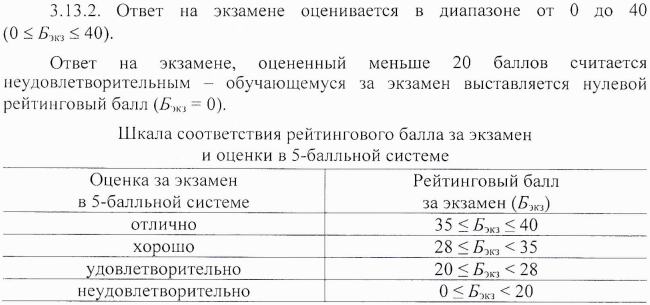

# Алгоритмизация и программирование

- Год поступления студентов: 2021;
- Лекции: 8 часов;
- Практические занятия: 8 часов;
- Основной язык: С++;
- Аттестация: экзамен;

*\* Академический час - 45 минут, т.е. пол пары.*

 

## Ссылки на материалы курса

- Курс на мудле: [https://moodle.cfuv.ru/course/view.php?id=21690](https://moodle.cfuv.ru/course/view.php?id=21690);
- Материалы на GitHub: [https://github.com/VladimirChabanov/alg_and_prog_zo.git](https://github.com/VladimirChabanov/alg_and_prog_zo.git);
- Доступ к практическим заданиям: [заполните форму](https://docs.google.com/forms/d/e/1FAIpQLSdnshmallDk0csD8QtkLWfR_fCuyFQSHChBZQW3yJhSt3iCfg/viewform?usp=sf_link);

 

## Система оценивания

Порядок расчёта баллов за экзамен - фрагмент приказа №135 от 11.02.2020 "Об утверждении Порядка применения балльно-рейтинговой системы оценивания успеваемости обучающихся по программам ВО в ФГАОУ ВО "КФУ им. В.И. Вернадского":

### Расчёт баллов за работу в семестре (Бсем)

Балл за работу в семестре определяется как сумма баллов по всем контрольным точкам (55 баллов) + бонусные баллы (5 баллов).

### Расчёт баллов за экзамен (Бэкз)

Экзамен проходит в 2 этапа:

- Тестирование. Проверяет полноту освоения курса (простое вопросы, но по всем темам);
- Опрос по билетам. Проверяет глубину освоения материала (несколько вопросов, но подробно).

Каждый этап оценивается отдельно, по 100 балльной шкале. Итоговая оценка за экзамен определяется по формуле:

$$Б_{экз} = 40\cdot\frac{Б_{1}}{100}\cdot\frac{Б_{2}}{100}$$

Если за первый этап получена оценка ниже 50 баллов, то за весь экзамен выставляется оценка *НЕудовлетворительно*, т.к. $Б_{экз}$ гарантировано будет меньше 20 баллов.
